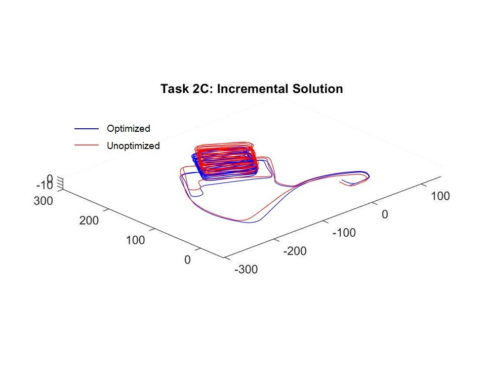

# Mobile Robotics Coursework
This repository is a collection of coding assignments I completed for the Mobile Robotics course at the University of Michigan. They were separated into localization, mapping, and SLAM tasks, each utilizing different methods, algorithms, and coding libraries found in the field.

**NOTE:** For more in-depth information on each task, included in each sub-folder is the PDF report I submitted with the assignment, which include additional figures, derivations, explanations, etc.

## Localization
The velocity motion model from Chapter 5 of *Probabilistic Robotics* was used in order to move a robot through an environment with six known landmarks. Artificial noise is fed to the actuators, causing it to deviate from the desired trajectory. Artifically noisy measurements for motion , as well as the range and bearing to the landmarks, are corrected using four different filters.

In the animations below, the **green** line represents the desired trajectory, the **blue** line and the accompanying black circle represent the true noisy trjactory, and the **orange** ellipse represents the robot's understanding of its position (which, naturally, we want inside the black circle). Graphs depicting deviation from ground truth and chi-square statistics can be found in the report.

### *Particle Filter (PF)*

### *Extended Kalman Filter (EKF)*

### *Unscented Kalman Filter (EKF)*

### *Right-Invariant Extended Kalman Filter (RI-EKF)*

## Mapping
Both discrete and continuous counting sensor models were used in conjunction with the [Intel Research Lab datasets](http://www2.informatik.uni-freiburg.de/~stachnis/datasets.html) from the University of Freiburg. Occupancy mapping and semantic mapping datasets were both evaluated, with the following results:

### *Discrete Model*

  
  
   
  
  

### *Continuous Model*

  
  
   
  
  

## SLAM
A MATLAB wrapper of the [GTSAM library](https://gtsam.org/) was used to perform both batch and incremental SLAM methods on the generated trajectories in the Intel Research Lab (2D) and in a parking garage (3D). Both are available at [Luca Carlone's website](http://lucacarlone.mit.edu/datasets/). Results were as follows:

### *Batch Solution*

  
  
  

### *Incremental Solution*

  
  
  

